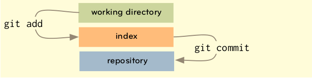
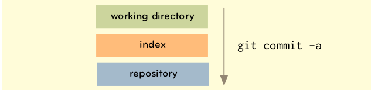

# Setting up your repository

```
git config --global user.name “Bilbo Baggins”
git config --global user.email “bilbo@shirerocks.com”
```

This will create a new ~/.gitconfig file that will look like this:

```
$ cat ~/.gitconfig
[user]
    name = Bilbo Baggins
    email = bilbo@shirerocks.com
```

# Getting a Git repository

## New repository

```
git init
```

This will create a .git directory in your current working directory that is entirely empty.

If you have existing files you want to add to your new repository, type:

```
git add .
git commit -m ‘my first commit’
```

## Cloning a repository

```
git clone git://github.com/justb/test_repo.git
```

If you want to put it in a different directory than the name of the project, you can specify that on the command line,
too.

```
git clone git://github.com/justb/test_repo.git myotherfolder
```

# Workflow

We can add patterns into the `.gitignore` file to tell Git that we don’t want it to track them. Example:

```
tmp/*
log/*
config/database.yml
config/environments/production.rb
```

A good way to find out what you’re about to commit (that is, what is in your index) is to use the status command.

```
$ git status
# On branch master
# Changed but not updated:
# (use “git add <file>...” to update what will be committed)
#
# modified: README
# modified: Rakefile
# modified: lib/simplegit.rb
#

no changes added to commit (use “git add” and/or “git commit -a”)
```

You could commit only the Rakefile:

```
git add Rakefile
git commit -m "Add new task"
```


If we want to commit all our changes, we can use this shorthand:

```
$ git commit -a -m ‘committing all changes’
```


## Removing

For removing files from your tree, you can simply run:

```
git rm <filename>
```

# Showing objects

The git show command is really useful for presenting any of the objects in a very human readable format.

```
git show branchname|SHA|tag|tree
```

# Diff

Git has a great diff utility built in that can give you statistics or a patch file given any combination of tree
objects, working directory and index.

```
justb:~/GitCourse  (master *)
⇒ git diff
diff --git a/usinggit.md b/usinggit.md
index f4d4eeb..28c451e 100644
--- a/usinggit.md
+++ b/usinggit.md
@@ -99,7 +99,13 @@ git rm <filename>
 The git show command is really useful for presenting any of the objects in a very human readable format.

 ```
+git show branchname|SHA|tag|tree
+```
+
+# Diff

+Git has a great diff utility built in that can give you statistics or a patch file given any combination of tree
+objects, working directory and index.
```

We can have a more compact view:

```
justb:~/GitCourse  (master *)
⇒ git diff --numstat
25      0       usinggit.md
```

# Branching

## Switching branches

Let’s say we’re working on our project and we want to add a new function to our library, so we’ll make a new branch
called `new-func` and switch to it. There are two ways we can do this

```
$ git branch newfunc; git checkout newfunc
```

```
$ git checkout -b newfunc
```


